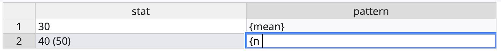

# blockr.dataeditr
DataEditR block


## Installation

``` r
# install.packages("pak")
pak::pak("cynkra/blockr.dataeditr")
```

## Usage

```r
serve(
  new_data_edit_block(),
  data = list(
    .data = data.frame(
      stat = c("30", "40 (50)"),
      pattern = c("{mean}", {
        "{n} ({%})"
      })
    )
  )
)
```



## Caveats

This block requires the following development package versions to be installed:

```r
pak::pak("DillonHammill/DataEditR")
pak::pak("DillonHammill/rhandsontable")
```

